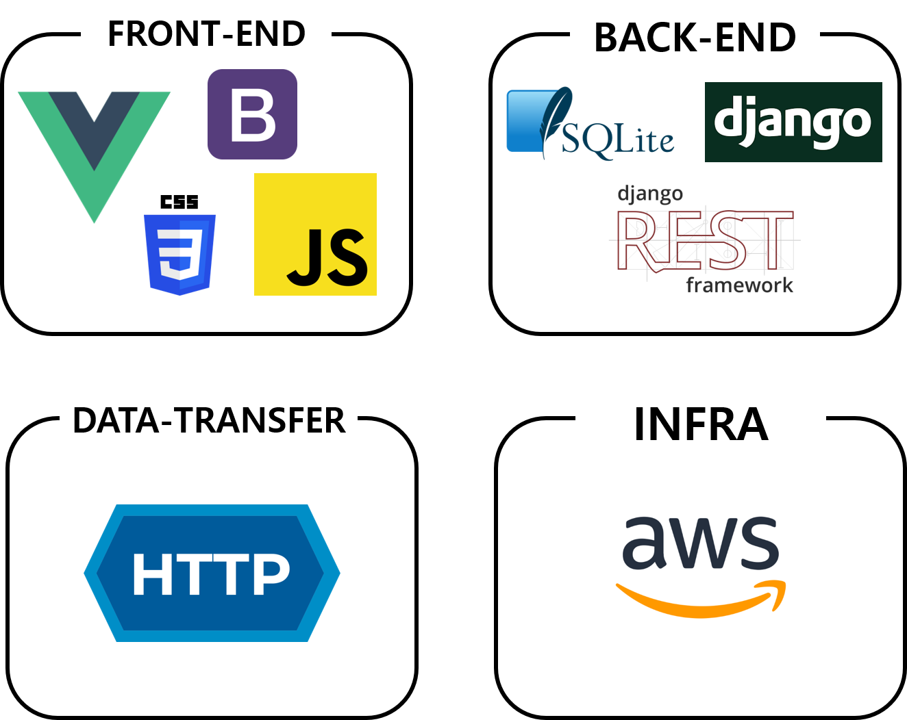

<h1 align="center">Welcome to METFLEX 👋</h1>
<p>
    
    
    
    <a href="https://github.com/connect-foundation/2019-01/wiki" target="_blank">
        
    </a>
    
</p>

​     

#### 🎥영화에 대한 리뷰를 공유할 수 있는 서비스

> 영화에 대한 평가가 궁금하신가요?
> 궁금한 영화를 찾아 리뷰를 확인해보세요!
> METFLEX는 영화에 대한 리뷰와 추천 영화를 제공하는 웹 서비스입니다.

   

### ⚙️INSTALL

👨‍💻Back-End

```bash
$ cd backend
$ python -m venv venv
$ source venv/Scripts/activate #윈도우 환경
$ source venv/bin/activate #리눅스 환경
$ pip install -r requirements.txt
```

​     

👩‍💻Front-End

```bash
$ cd frontend
$ npm install
```

   

### 📝ERD

<div style="width: 90%; margin: 0 auto"></div>

​    

## 🔧 Tech Stack


<div style="width: 70%; margin: 0 auto"></div>

​        

## 🗃 Project Folder

```
📁Final-PJT
├── 📁backend
│   ├── 📁accounts
│   ├── 📁community
│   ├── db.sqlite3
│   ├── 📁final_project
│   ├── manage.py
│   ├── moviedata.json
│   └── requirements.txt
└── 📁frontend
    ├── babel.config.js
    ├── 📁public
    └── 📁src
        ├── App.vue
        ├── 📁api
        ├── 📁components
        ├── main.js
        ├── 📁router
        ├── 📁store
        └── 📁views
            ├── 📁accounts
            └── 📁movies
```

​       

## 👨‍👩‍👦‍👦 Author

👤 전공파괴

> 🦸‍♀️ [전은정](https://github.com/eunjung-jenny)<br />
> 🦸‍♂️ [공태경](https://github.com/Taeg92)<br />

​           

## 🤝 Contributing

Contributions, issues and feature requests are welcome!<br />Feel free to check [issues page](https://github.com/connect-foundation/2019-01/issues).

***

_This README was generated with ❤️ by [readme-md-generator](https://github.com/kefranabg/readme-md-generator)_